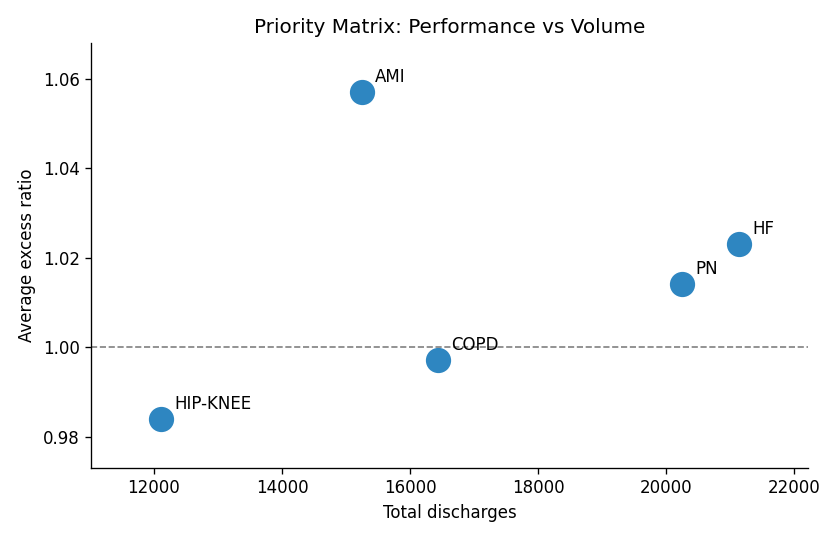
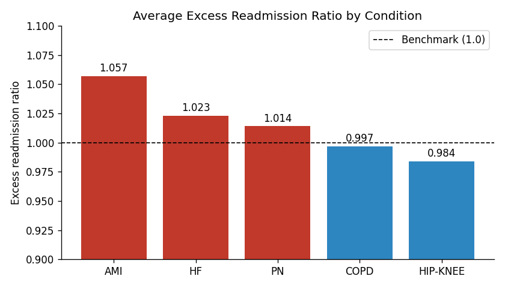
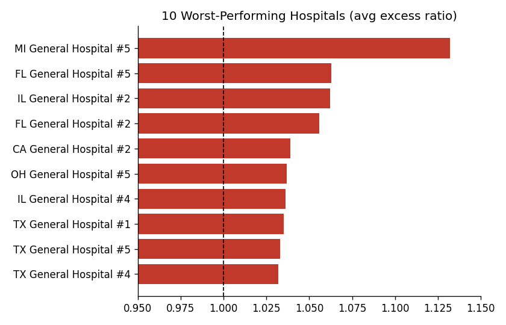

# Hospital Readmissions Analysis

Which conditions and hospitals are driving excess 30-day readmissions, and where should a quality-improvement team focus first?

**Tools:** SQL (SQLite), Python (pandas, matplotlib), Excel



## Business problem
Under the US Hospital Readmissions Reduction Program (HRRP), hospitals with more readmissions than expected lose part of their funding. An **Excess Readmission Ratio** above 1.0 means a hospital readmits more patients than expected for that condition. With limited quality-improvement resources, the question is where effort will have the most impact.

## Dataset
- 250 records: 50 hospitals × 5 conditions (AMI – heart attack, HF – heart failure, PN – pneumonia, COPD, HIP-KNEE replacement)
- Columns follow the structure of the public CMS HRRP file: discharges, excess readmission ratio, predicted/expected readmission rates, number of readmissions
- 15 records are marked **"Not Available"** (suppressed), which mirrors how CMS hides small counts

> **Note:** This is a **synthetic dataset** modelled on the CMS HRRP structure, built for practice. Hospital names and values are not real. The same analysis applies directly to the real CMS file.

## Approach
1. **Cleaning:** loaded "Not Available" as NULL and excluded those records from averages instead of treating them as zero. Extracted the condition from the measure name.
2. **SQL analysis:** aggregations, `HAVING` filters, a CTE to estimate excess readmissions, and a `RANK()` window function to find the worst hospitals per condition. See [`sql/analysis_queries.sql`](sql/analysis_queries.sql).
3. **Visualisation:** charts in Python (matplotlib).

## Key findings
| Condition | Avg excess ratio | Total discharges | % hospitals above 1.0 |
|---|---|---|---|
| AMI | **1.057** | 15,242 | 89.6% |
| HF | 1.023 | **21,131** | 68.9% |
| PN | 1.014 | 20,241 | 62.0% |
| COPD | 0.997 | 16,435 | 48.9% |
| HIP-KNEE | 0.984 | 12,106 | 33.3% |

1. **AMI has the worst performance.** Its average ratio is 1.057, and nearly 9 in 10 hospitals are above the benchmark.
2. **AMI and Heart Failure together drive over 80% of estimated excess readmissions** (≈121 and ≈94 readmissions, from the CTE in Q3). HF has the highest patient volume (21,131 discharges), so even a small ratio improvement there reaches the most patients.
3. **MI General Hospital #5 is an outlier.** Its average ratio is 1.132, far above the next worst hospital (1.063), and it ranks worst in 4 of the 5 conditions.
4. **Pneumonia is a hidden risk.** Its ratio is only slightly above 1.0, but volume is high, so it is the third-largest source of excess readmissions.
5. **COPD and hip/knee replacement are performing at or better than expected.** These are lower priority.

## Recommendations
- Make **AMI and HF** the two priority programmes: AMI because it has the worst ratio and the most excess readmissions, HF because it has the largest patient volume.
- Run a **targeted review at MI General Hospital #5**, since the problem there spans every condition. That points to hospital-wide processes, not one department.
- Track these ratios quarterly to measure whether interventions work.

## Limitations
- Synthetic data, so the findings demonstrate the method, not real hospital performance.
- Suppressed records were excluded, which may slightly bias averages for the affected hospitals.
- The ratios are risk-adjusted by CMS, but they don't explain *why* readmissions happen. That needs patient-level data.

## Charts



## How to run
```bash
pip install -r requirements.txt
python analysis.py
```
This runs every SQL query, prints the results, and regenerates the charts in `images/`.

## Repository structure
```
├── data/hospital_readmissions_data.csv
├── sql/analysis_queries.sql
├── images/
├── analysis.py
└── README.md
```

---
*Author: John Abraham · [LinkedIn](https://www.linkedin.com/in/john-abraham-531947221) · MSc Data Analytics, De Montfort University*
